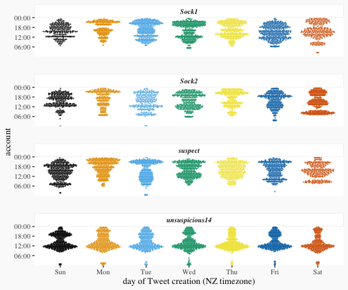
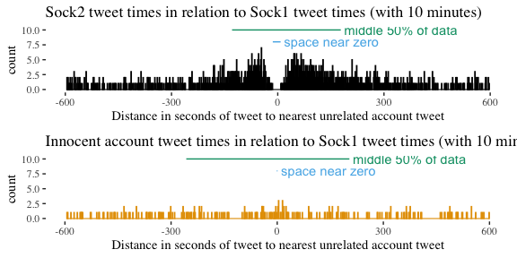

# Learning from a Sock Puppet cluster

This is the easy to read, no code write-up of the analysis (which I assume you are viewing online), to see the embedded code that generated this analysis, have a look at the README.rmd version of the file in the same github repo. For offline viewing of the easy to read version, there is also README.pdf in the github archive.

Taking a recent example of clear sock-puppet accounts among New Zealand fringe Twitter, I am using the opportunity to test how the sock puppetry shows up when approaching the data through various analysis lens, and how the techniques employed reflect assumptions about the data being looked for.

This was a case of sock puppet accounts identified through detail content investigation and domain expertise, I am trying non-content based methods.

There are three specific accounts I am measuring the techniques against:

1) Sock1 a clearly identified sock puppet 
2) Sock2 a clearly identified sock puppet
3) Suspect an account linked to both sock puppets in the content posted.

(these are all pseudonyms, as is every other account mentioned in this- no real screen_names are revealed in this analysis, just concentrate on the techniques employed)

There are a series of problem specific assumptions I can make about sock puppet accounts set up to amplify a message or account:

1) The sock puppet owner only has limited daily time to tweet, so the unavailable to be on the Internet times will be similar between sock puppet accounts.

2) Most followers of a sock puppet accounts do not know they are a sock puppet (assumption sensitive to number of followers)

3) Most followers of a sock puppet account are interested in the content of that account, so interested in similar content (I think this holds regardless if people are following the account because they like the content .

4) The person behind the sock puppet account is creating multiple identities to amplify content, so those multiple identities will have similar content (only for those accounts using sock puppets to amplify, rather than to stir up a fight with opposing sock puppets)

Given those assumptions:

Sock puppetry occurs in a context, so analysing the context reveals the sock puppetry. People who follow a sock puppet may be more likely to follow accounts from the same source, so I can use that following to trace other sock puppet instances.


An account has followers that see content from that account on their timeline, this is the core group to whom content is amplified. Using the API, I can download the full context of Sock1. This code is not included here, but is at https://gist.github.com/thoughtfulbloke/e93e184129823b51f81998fbf8f0c1c4


Taking the 955 followers, I can download the friends lists of those accounts. Because of following the sock puppet these accounts have a high chance of also following related sock puppet accounts.

While the 955 account friends lists are 100 MB, it does take nearly 16 hours of computer time to download, as the API limits friends lists downloads to 15 downloads (each list of 5000 or less most recent friends) of lists per 15 minutes.


The 925 friends lists contain a total of 1,964,459 befriended accounts. Before doing anything more complex, it is easy to check the amount of Sock1's friend list that each other friend's list contains coverage of:


<!-- -->

Overlap of context does seem to be a useful technique in and of itself, but for the purposes of analysis I would like to assume that the related accounts were less clear in the data, and see what more can be done.

If one aggregates the befriended accounts across all friends lists, it generates a crowd-sourced recommender like list of the form "if you were interested in Sock1, then...". As any particular account can only befriend another once, spread of names is the only measure of popularity, rather than any intensity measure (at this stage).


Which gives a distribution of being befriended.

<!-- -->

Because I am writing this for a technical audience I will just not I was using a log2(n+1) transformation to aid visibility when looking at the graph to see the overall pattern, and note nothing very interesting seems to be going on in the graph among accounts befriended by less than 125 of Sock1's followers. So as a next step I zoom the graph into the high (greater than 125) end with less data transformation.

<!-- -->

Picking up more data is going to be another small human time/ high computer time process, so I am going to try and minimise the waiting time by exploring the data to make a few assumptions.


The long tail for the number of befriendings seems to begin about with about 200 shared followers, and the 141 accounts that reach this level is a much more manageable amount in terms of time.


However, this set of commonly followed accounts also includes general international alt-right accounts commonly followed by the fringe as well as local accounts. As these are major international accounts, a threshold of 50000 followers is a useful split for filtering these out, and focusing on the local.

<!-- -->

Once, again the sock puppet related accounts stand out, suggesting something useful can be done with this idea.

Another approach, is that in order to be a amplifying sock puppet, the sock puppet must be amplifying. This should be reflected in the behaviour of the likes and retweets.


<!-- -->

Likes awarded by Sock1, and retweets by Sock1 are clearly not independent, and both together, or individually, strongly favour the three sock puppet related accounts.

Up until now, this has been establishing that Sock1 is similar in context to the suspect account and Sock2, and is boosting these accounts, but it has not been established it is a sock puppet (a false identity account). This requires comparison between accounts, and to keep it computational possible, I can used the boosted accounts as a starting pool. Downloading the short-list of the 40 most boosted accounts takes around a hour, but is a human practical set size. Again, this is using the code from https://gist.github.com/thoughtfulbloke/e93e184129823b51f81998fbf8f0c1c4 with shortlist$user_id.


To do this, I am focusing on what indicators in the time of posting say about the poster's behaviour.


One way of presenting time is as a continuous line, one continuous variable measured to the level of a second.

<!-- -->

This is reasonably clear at identifying similarities when there are similar numbers of posts, but harder to judge the level of similarity when the sample sizes are different.

<!-- -->

If looking at individual events over time, it can be clearer to model the data as events within a day over a series of discrete days.

<!-- -->

Working with both the in-day and over time patterns helps to identify specific patterns of similarity and difference. In this case 2-dimensional times when the suspect account was highly active are similar to when the sock puppet accounts were active, though the overall posting frequencies of the sock puppet accounts were lower.

This within day posting pattern can be aggregated to a general within day pattern for accounts

<!-- -->

Keeping in mind that a "day" is cyclical, so any activity just after midnight (local time) is part of the preceding days activity.


<!-- -->

It is easy to rule out accounts from being sock puppets, if they do not share the same nightly minima (for most people between 1am and 4am local time), as the people behind the accounts are not sleeping at the same time. In this particular case, all the accounts are sleeping at the same time, which does not rule them out from being sock puppets, but cannot be treated as positive evidence as many people can be asleep in the same time period.

As a side note, sleep period comparison can provide evidence that an account claiming to be in one country is unlikely to actually be so. In particular, New Zealand has a lightly populated timezone by world standards, and large gaps in time to the time zones that take an interest in our country.

As well as combining data into one overall daily pattern, it can be aggregate as weekday/weekends or individual days of the week.

<!-- -->

Patterns through every weekday tends also to be used as a "ruling out" indicator- if there is a shared clear absence of tweeting at a particular time, and that time is unusual for people in that timezone, that is evidence that the accounts share a reason for regularly not tweeting at that time. In this case there are similarities in use between the sock puppet and suspect accounts, but no highly characteristic gaps, so it is not very conclusive.

All the time analysis so far has been relation to the general passage of time and life events influencing the ability to tweet, with some judgement about how shared those events are people different members of the population, then inferring the likelihood of being the same person

In the case of sock puppet accounts there is a shared life event common only to the sock puppet accounts, that of being the same person. Being the same person imposes certain limitations on tweeting:

* Tweets occur close in time as the person is swapping between accounts to undertake activity in both accounts.
* Tweets do not occur at exactly the same time, because while a persons is tweeting under one identity they will not be able to tweet in the other identity until they swap.

Taking an account of interest, in this case Sock1, I can compare how close together in time other accounts are tweeting in relation to the closest.

I think it worth noting in passing that time isn't strictly a linear continuous thing any more, what I am expressing is an accounts relations to important moments (which I was also doing earlier in relation to things like common sleep times).


<!-- -->

This is specifically comparing tweets within 10 minutes between the two accounts, as that seemed a good time threshold for exploring a relationship that is expected to be close in time. When comparing the relative timing of tweets between accounts and Sock1, four things differ between the sock puppet account and an unrelated non-sock puppet account stand out to me:

* There is gap at zero in the case of the sock puppet. For around 10 seconds either side of a Sock1 tweet, Sock2 never posts (as the person has to switch accounts)
* There is a surge in the sock puppet account once it changes accounts (within around a minute). This captures the behaviour that the person is swapping accounts in order to use the other account causing a surge.
* There are more tweets within 10 minutes between the sock accounts than between a sock account and another account. This again reflects the swapping accounts to use the other account. I am not doing anything more detailed with this particular metric on this occasion, but suspect something could usefully be done as a measure like tweets within 10 minutes as a percentage of total tweets.
* The sock puppet account is asymmetric. This reflects a human being slipping into a habit about which account they use first, creating an imbalance between greater than and less than zero. I am not exploring this metric further on this occasion either. 

Focusing on the the aspects of space around zero and clump near the middle, these can be automatically measured.

<!-- -->


As the space near zero is larger in the sock puppet case, and the middle 50% of the data occupies a smaller range in the sock puppet case, dividing the space near zero (measured in seconds) by the range of the middle 50% of the data (measured in seconds) produces a single measure that is higher for sock puppet accounts than unrelated accounts.

As a sock puppet detection mechanism, this is vulnerable to having an accomplice tweet at the same time to distort the metric, but:

* As I only came up with this, I do not expect people to be deliberately countering this yet.
* It is entire possible to take these observations and construct a less sensitive analysis (both in the good and bad sense).
* That would now be two people sharing an account which is a different (though closely related) problem space anyway.

Both the space around zero and the range of the middle half of the data are sensitive to sample size- if there only four tweets in 10 minutes there might be a very large random gap around zero, but it would not mean much in terms of identifying the two accounts as sock puppets.

So, comparing sample size with the single sock puppet measure - the Key Sock puppet Indicator, gives a result like this 

<!-- -->


The suspected-linked and the known sock puppet accounts are separate from the rest of the accounts that were being boosted, but this representation by itself doesn't indicate how likely these accounts are to be sock puppets (with the likelihood changing with sample size).

The normal range for a given sample size can be calculated through a simulation test. If there is no relationship between the two accounts, then posts in one account are not influenced by posts in the other. This can be represent by simulated the difference between two unrelated accounts through making a random draw of the appropriate sample size across the time period (10 minutes each side of zero) and calculating the key sock puppet indicator. By doing this repeatedly, it generates the range of expected key sock puppet indicators for a given number of tweets within 10 minutes (the sample size). As I am interested if observed values are outside the expected range, I am expressing that as "for a given number of replications, what is the maximum value seen at that sample size" and calculating out the values for several different replications, depending on how sure people want to be that it is a sock puppet.

* 400 - The maximum value I got in 400 random tests, which means I am extremely confident there would not be a more sock puppet like account if you compared 100 innocent accounts with a test account (there is a strong buffer zone here). As it is easy to compare a lot of accounts on the Internet, I personally find this threshold a little low for my comfort.
* 4,000 - The maximum value I got in 4,000 random tests, which means I am extremely confident there would not be a more sock puppet like account if you compared 1,000 innocent accounts with a test account. I would be comfortable saying any comparison exceeding this threshold has very strong likelihood that the two accounts are a sock puppet.
* 4,0000 - If the comparison of two accounts exceeds this threshold, they are going to be sock-puppets.
* 400,000 - I only included 400,000, which took over 40 hours to process, as there are 330,000 active New Zealand Twitter accounts. So if you compared every single innocent New Zealand Twitter account (and they were at this sample size) you would not expect to see a number this high.

Because the simulation takes over 40 hours to run on my computer, I am including the code separately, as I do not want the code to run when I am generating the final form of this document. I saved the results in a set of csv files that is available as a companion files with this (also for others to draw on in their own analyses). Also because it took so long to calculate, I only used sample groups in steps of 10, and am just assuming you will not learn much interesting from very small sample sizes.


```
## Warning: Removed 4 rows containing missing values (geom_path).
```

<!-- -->


The graph has been limited on the vertical axis to only show the zone where there were account results, rather than extending to around 10.

The two accounts that are unequivocally sock puppet accounts from the same person as Sock1 are the suspect account and the Sock2 account. Suspect is at a level that you would need to compare somewhere in the order of magnitude of a billion accounts to see an innocent account that looked that much like a sock puppet, while Sock2 is even less likely to be innocent.


